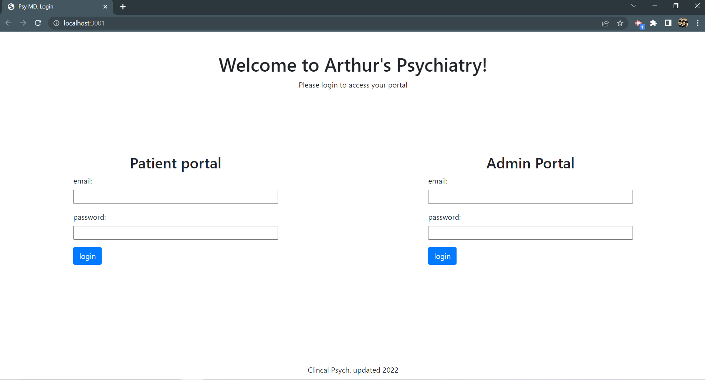
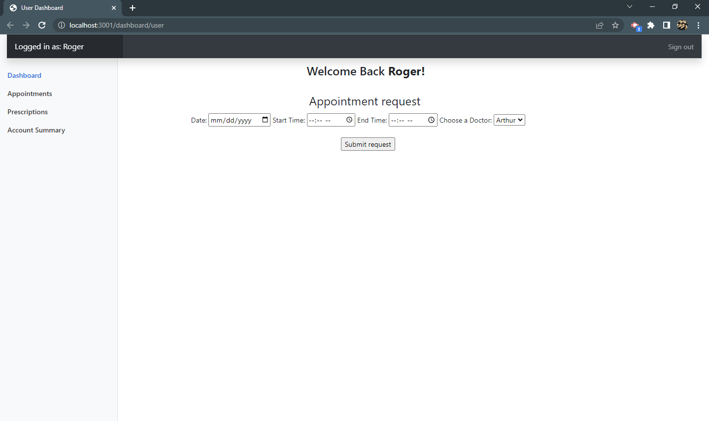
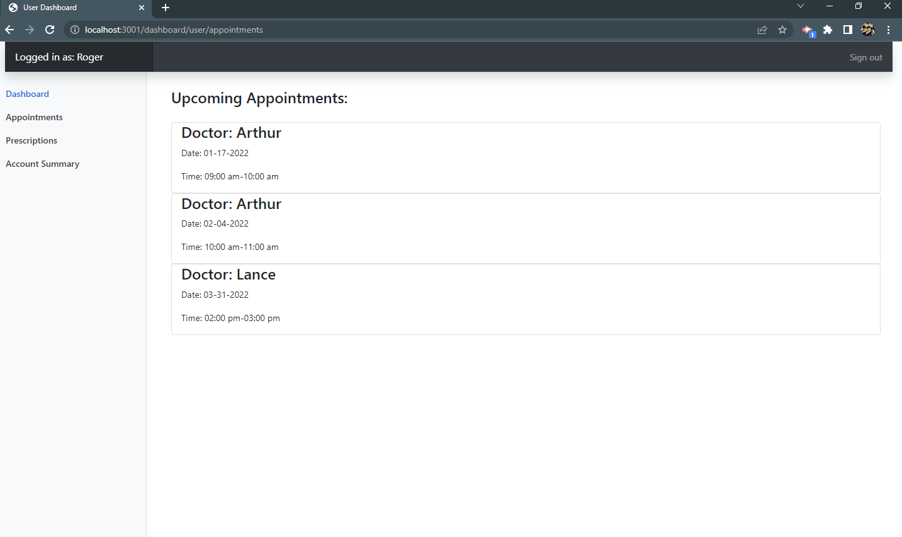
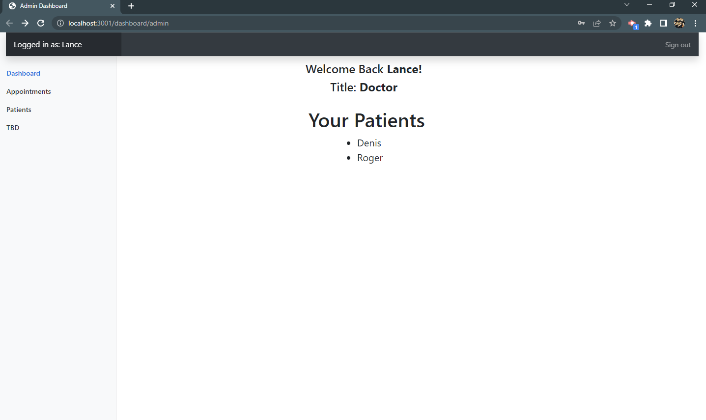
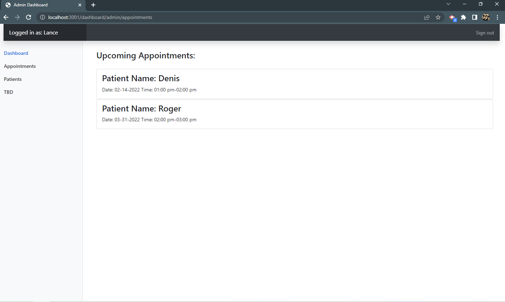
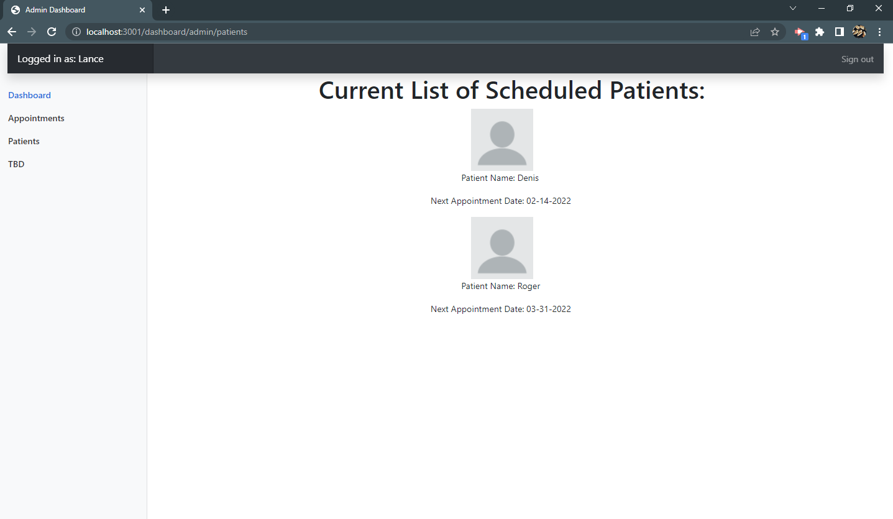

# Clinical Platform Streamlined

## Description
A straight forward and user friendly web application that helps small medical practices organize their appointments. As an example, a small psychiatry practice is being used.   

 ## Table of Contents:

  **[Technology Used](#technologies-used)**  
  **[Application Demos](#application-demos)**  
  **[Link to Deployed Page](#link-to-deployed-page)**  
  **[References](#references)**  
  **[Devlopment Process](#development-process)**  
  **[Author](#author)**  

## Technologies Used:
* Handlebars  
* Bootstrap  
* Express.js, Node.js, and Moment.js  
* bcrypt, dotenv, mysql2, and sequelize  
* GitHub, Heroku, SQL, SQL Workbench, JawsDB, Slack, Discord, Chrome, Chrome Dev Tools  

## Application Demos:

  
  
  
  
  
  

## Link to Deployed Page:
https://clinic-coders-office-solutions.herokuapp.com/

## References:
* Patient picture obtained from WandererCreative hosted by Pixabay  
* Appontment form inspired by https://form.taxi/en/sample-forms/appointment-request  
* Profile and other cards card inspired by https://www.w3schools.com/bootstrap4/bootstrap_cards.asp and https://www.w3schools.com/w3css/w3css_cards.asp  
* Dashboard inspired by https://getbootstrap.com/docs/5.1/examples/  
* Medication information obtained from https://reference.medscape.com/  

## Development Process:
1. Set up base files, created proposal, and wireframed  
2. Pseudocoded files  
3. Started with main landing page display, simple login, minimal routes, and minimal seed data  
4. Used Kanban board to create small goals/tasks with end in mind  
5. Split into front end and back end  
6. Created back end database, server, and routes  
7. Created front end handlebars and CSS  
8. Set up server with database  
9. Tied in front end and back end  
10. Implemented optional enchancements  
11. See commits for more details  

## Author:
* Created by Timothy Zalewski | [GitHub](https://github.com/Tim-Zebra)
* Created by Stephen K | [GitHub](https://github.com/skelly2022)
* Created by Joshua Dominguez | [GitHub](https://github.com/jcd2k)
* Created by Jon Edwards | [GitHub](https://github.com/JonNotJohn440)